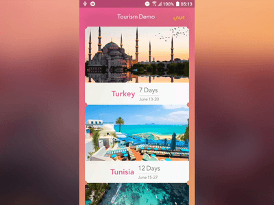

A Flutter tourism app that is backed-by Redux, shows animations, internationalization (i18n, English <=> Arabic), ClipPath, and fonts.

### Credits
    Smarto Dev
    
## Flutter: Getting Started

For help getting started with Flutter, view our online
[documentation](https://flutter.io/).
